# Mulmopro guides - Coding workflow

A guide by Mulmo-helper


This tutorial (which is a work in progress) will guide you through the steps for setting up your Windows machine to be able to work with a local Linux (Ubuntu) environment, without the need to having a dual-boot system or using a virtual machine. This will be done by using the native **Windows Subsystem for Linux**, or WSL.

You will then set up your system to be ready to use **GIT**, the version control system used employed in the **Mulmopro** team to manage all the different simulation templates for our work and keep them up-to-date in a central space available to everyone!

The easiest way to manage all of this will be through the use of a very simple but very powerful text and code editor, **Visual Studio Code**.
Through VS Code, you will access your WSL, and when inside the WSL you will be able to access and work on all your simulations through GIT.
After that, happy coding 🧑‍💻!

## Windows 11 guide

### Install GIT in windows
- Download from https://git-scm.com/download/win the main version (64 bit)
- Install with default settings. It is recommended, when prompted, to change the name of the default branch from "master" to "main": when asked, select "Override default branch name". Leave rest as the default.


### Install VS Code
- Download from https://code.visualstudio.com/download
- Install with default settings. Check that Add to PATH is selected (should be selected by default), optionally check the two "Open with Code" for con contextual menus

### WSL
The following steps for installing and setting up the WSL are present, in more detail, on [Microsoft Learn platform](https://docs.microsoft.com/en-us/windows/wsl/tutorials/wsl-vscode).

It is preferable to install WSL2 over WSL. It is available for
- Windows 11
- Windows 10
	-   For x64 systems: **Version 1903** or later, with **Build 18362** or later.
	-   For ARM64 systems: **Version 2004** or later, with **Build 19041** or later.


- Install WSL. You can follow the steps here: https://learn.microsoft.com/en-us/windows/wsl/install. Either
	- Install it from the Microsoft Store ([from November 2022 this will serve you the latest version](https://devblogs.microsoft.com/commandline/the-windows-subsystem-for-linux-in-the-microsoft-store-is-now-generally-available-on-windows-10-and-11/)), it will shown up without the number "2", see picture.
	- In the Windows Powershell, type  
	```
	wsl --install
	```

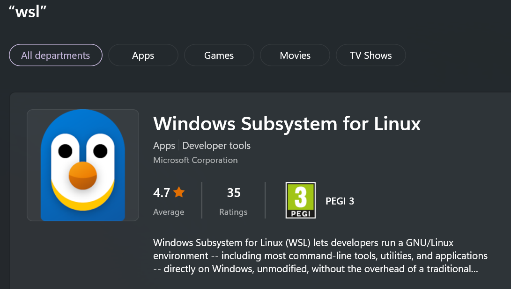

- Check that the WSL needed optional components are activated.
	- Type Win+R, execute optionalfeatures.exe

	 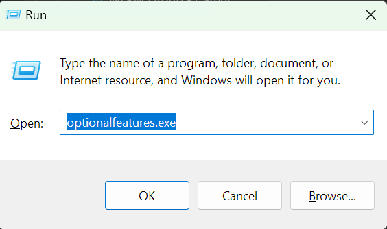

	 - Enable *Windows Subsystem for Linux*
	 - Enable *Hyper-V* (if present)
	 - Enable *Virtual Machine Platform*
	 - Restart the system when asked
	
- Install the Ubuntu "app" from Microsoft Store


- Launch Ubuntu, and set it up with a new username/password. These will be your username and password for the Ubuntu inside the WSL.

- As indicated in the more in-depth guide [here](https://learn.microsoft.com/en-us/windows/wsl/setup/environment#update-and-upgrade-packages), this is a good time to update the "packages" (i.e. the libraries and pre-installed programs) in your Ubuntu distribution. Do that by writing in the terminal the following code. You will be asked for the password you just set, so it'sa good chance to commit it to memory!
```
sudo apt update && sudo apt upgrade
```

### Accessing the WSL from VS Code

From now on, we will do most of our Linux stuff using VS Code as our entry point, so we need a way to facilitate the connection between the two systems. More details about the features and advantages of doing so can be found [here](https://learn.microsoft.com/en-us/windows/wsl/tutorials/wsl-vscode).

Detailed explanations of the fetures of remote development in the WSL can be found [here](https://code.visualstudio.com/docs/remote/wsl) and [here](https://code.visualstudio.com/docs/remote/wsl-tutorial). Be warned, as some of the tutorial steps you will find there are duplicates of the steps you are reading here. Follow one guid only to the end for your initial setup!


- Open VS Code, and install the needed extensions. 
	- You may be prompted to install some recommended extensions if it is the first time you open VS Code after installing the WSL (see picture)

	

- You can accept and install or disregard it. We are going to install the **Remote Development** pack (picture) that comprises all the extensions we need to operate inside the WSL easily.


- From the Extension menu on the left (Ctrl+Shift+X) search and install the Remote Development pack
- When the extensions are installed, you can access the WSL by clicking on the " ><"  button at the very bottom left of your screen (used to manage remote connections) and selecting "Connect to WSL". Alternatively, learn to use the very convenient *Command Palette* to quickly look for and execute commands. Use the hotkey Ctrl+Shift+P to open up a text search menu at the top (the Command Palette), and type "Connect to WSL" to execute the same command.


Once that's done, the remote button should indicate that you're inside the WSL!


- Test this by opening a folder (you can select "Yes" to "Trust the Authors?" if prompted) and navigating in your Ubuntu subsystem. Open a terminal by the menu View > Terminal (or Ctrl+\` if you have an US keyboard set): welcome to your new Ubuntu machine! You can now use this as you would a regular bare-metal Linux installation.

### Using GIT to access the Mulmopro codes

🚨 *Be sure to have a github account and to have been invited to the Mulmopro organisation before starting this step!*

To get started on the basics of what GIT can do and how to perform the basic actions required to get code from a remote repository, modify it, and upload your modifications to the cloud, you can take a look at this [very good introductory video](https://www.youtube.com/watch?v=i_23KUAEtUM) (7 minutes), which can also be found at the top of the VS Code documentation on source control, [here](https://code.visualstudio.com/docs/sourcecontrol/overview#_git-support).

You can find a streamlined tutorial on how to use GIT to access and modify actual Mulmopro code repositories here (INSERT MULMOPRO PAGE LINK).
Now instead we will finish this guide by going through the very first steps to learn the basics of GIT.

First, you need to sign in in VS Code with your Github account . There are many ways to do this but the easiest is to click on the bottom left Profile button and activate Settings Sync, which will ask you to sign in to VS Code. Choose "Sign in with Github" from the top menu and you will be brought to your browser and asked for your Github credentials, as below.
Sign in, and you will get a series of prompt for authorization.
Authorize VS Code from the browser, click yes to open VSCode from the browser if prompted, and also authorize the Github Authenticator extension to access the URI if prompted.


Great, now you have linked VS Code to your Githb account! The classic way for using git is via the terminal, but now we are equipped to use VS Code as our graphical interface to manage all of this actions instead.

While we're at it, let's also install another extension, the **GitHub Pull Requests** and Issues extension. We will not use it now but it can be useful for easier Github management and for more complicated workflows.
Another extension which is nice to have is **GitLens**.


Unfortunately it is not sufficient to set up Github with VSCode, you also need let the operating system (Ubuntu) know your username and email which you are using with git. Do it now lest you forget (I frequently do!)

Open a terminal as before (you can do it from any folder in your system!), and inside it, type:

```
git config --global user.name "yourUsername"
git config --global email "yourGithubEmail"
```

like this


Now we are ready to *clone* a repository, which means downloading an existing repository from the cloud. Before doing that, create a folder where we will put this repo, and others you may want to work on: you can give it whatever name you like!
To do that, use the command palette and look for "git clone", then Clone from Github.


After that you will be brought back to the browser to authorize the "Github for VS Code" app. Don't worry, we will only have do this process just this once!

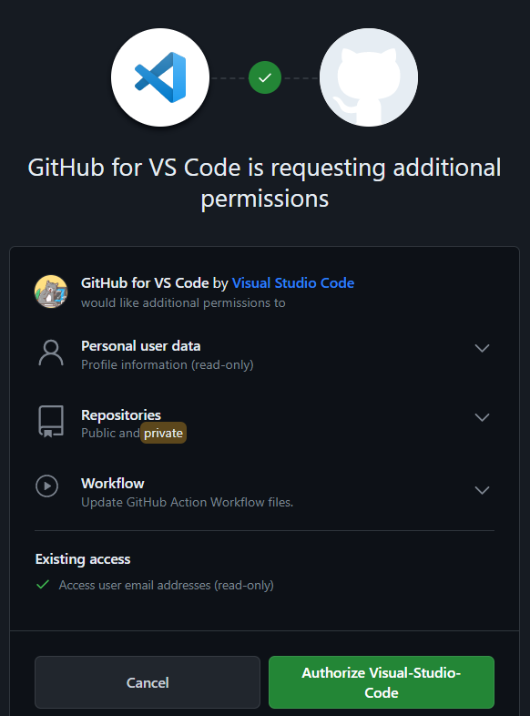

When you have given all the authorizations, you will bebrought back to VS Code and prompted for the name of the repository you want to clone. Since it recognizes you as a member of the Mulmopro organisation, all available repositories under *mulmopro/* should appear first.

We have set up a welcome repository for testing, where you can do all the changes you want while learning - we're going to try something on this repo right now, follow the guide and don't be afraid to make your own modifications or adding files, this is a playground for learning!

Look for the "mulmo-welcome" repo which we use specifically to test out Github for new users, by typing "welcome" in the search bar. 
The search functionality is good but a bit finicky at times, if you can't find the repo you wanted try again writing it differently, or just explicitly write *mulmopro/* at the beginning of the search to force looking into only our own repos.

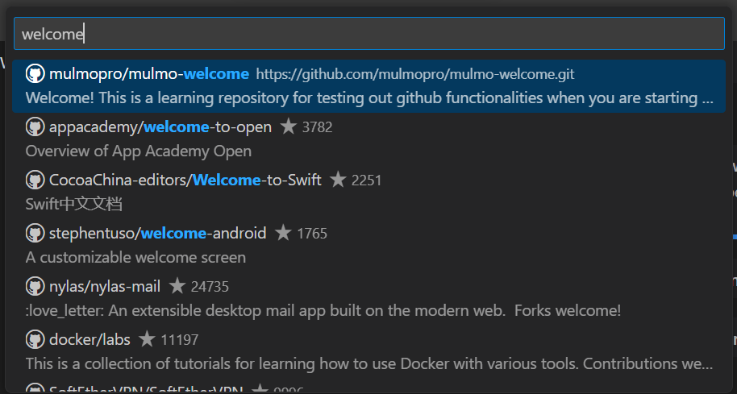
_____________
And put the repository (it will be in its own folder) inside the main folder you created earlier. I've created the */helper/repos* earlier for this.


When prompted, it is best to open the repo in a new workspace and not add it to the current one, so that you will have a dedicated VS Code window to work on this repo only: this will let you make the most of the git functionalities without any confusion.


You should have your clean VS Code window inside your newly-cloned repository: now you have a local copy of all that is inside of the repository, which for now is just a README file with a welcome message (in light gray you can see who made the last modification, and why - this shows up if you installed the **GitLens** extension).


Try writing something in the file after the line break, and save the file. Your local file has been updated, but the file in the cloud (in the mulmopro repo online) was not.

Github can see this, and brings you a notification: you have pending, *un-committed* changes. You need to *commit* these changes, which means to stack the incremental changes you have made to the file on top of the "history" of that file, and of all the repository. Together with the commit action, you should also write a very brief message, detailing what was done. If you wrote "Hello!" in the file, you could express this as "added salutation" in the commit message.

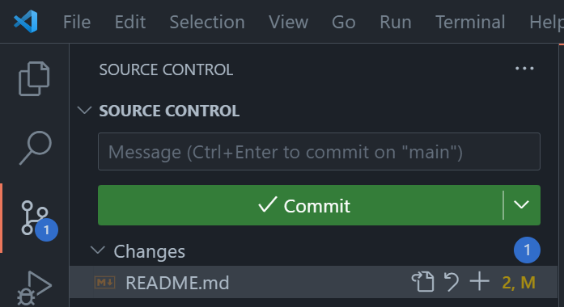


As an aside, there are a lot of reasons for [trying to write good commit messages](https://levelup.gitconnected.com/the-importance-of-good-commit-messages-9331251e5e33), some of which [may be outside of our scope](https://medium.com/swlh/why-should-i-write-good-commit-messages-e15d37bf45cb) as a team of engineers just trying to work together. It is still good to try and at least write *some* short message, so that looking back it is possible to have an idea of what was done, instead of having to sort through some undecipherable mess.. Try to come up with just 2 or 3 words, it helps everyone in the future!

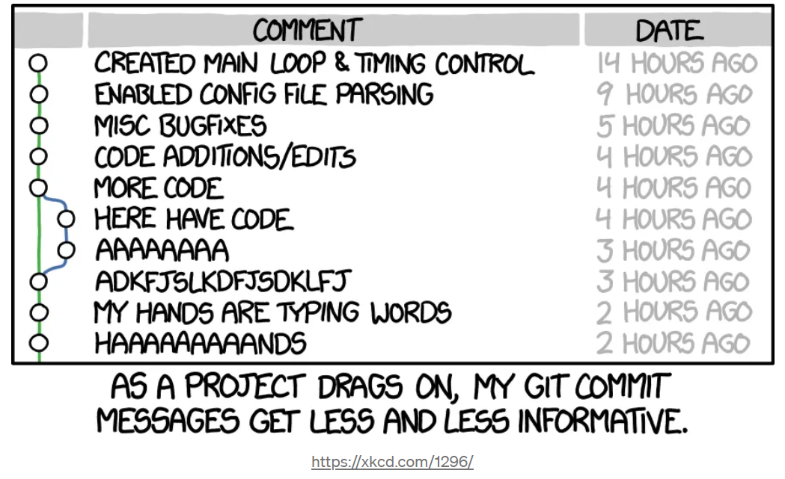

Write your message and click Commit. If this is your first time, you will be asked if you want to also stage your changes together with the commit. This is a finer distinction which we won't get into the details of, as most of the time you won't have to think about this. Select "Always" and continue.

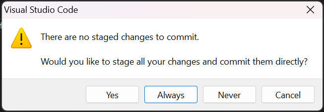

If you forgot to set up your username in GIT you will now get this error message, fix it as explained above by setting up your *user.name* and *user.email* in the terminal.


If your user was set up correctly in your system, you will see that the changes have been committed so now your local git repository has an updated history of what happened to your file, and its most recent history carrying all the chain of events leading to this version. This means that the main remote repository in the cloud is now one step behind us! You can check that at the bottom bar, which tells you that there is 1 commit (your "salutation") that needs to be *pushed*, which means needs to be uploaded, to the remote repository in the cloud. That one, the one on the github website, is called *origin*, and we are doing our modifications on the *main* branch. One single repository could have different *branches* of development, with different teams developing different features in parallel (in different branches) for the same app or code. We will not care about branches for now, as we will have only one monolithic "tree", called "main".


You can push the changes you committed by clicking on the small button in the bottom bar, or with "Sync Changes" in the Source Control tab.

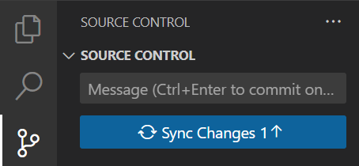

Github will tell you that the changes will be pushed, and if this is the first time doing something with git, you will be prompted if you would like to periodically run "git fetch". If you don't know what that is, select "No".

Congratulations! You have now pushed your first commit on a main repo. The changes are now visible to everyone, if they were to pull the repo to their local machines, or by going to the [repository website](https://github.com/mulmopro/mulmo-welcome):

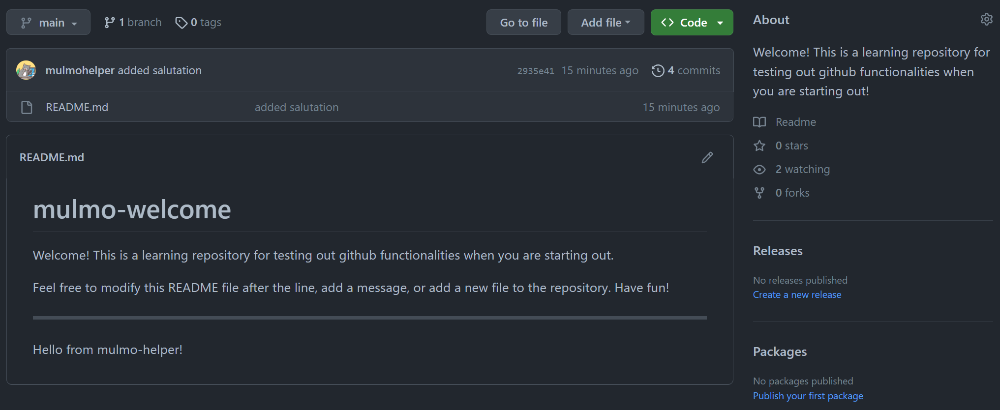

The very last thing to learn is what to do is you don't just want to modify files, but you are adding them yourself: new codes, new settings files, whatever.

From the Explorer tab on the left (where you manage files and folders), still inside of this same repository, create a new text file and write something inside.


The explorer is now letting you know that your file, marked as **U**, is *untracked*.
This means that not every file you put inside of a local git repository (like this folder) is uploaded when you sync your changes (as it does with cloud file-sharing services, like Dropbox or OneDrive). Github needs to be told to *track* the file, to know that it's important for you to also put this file and all subsequent modifications in the git history with everything else.

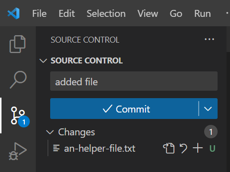

Since the default wanted behaviour is to just commit everything new that appeared in the repository, if you click Commit, everything will be committed (remember to enter a commit message inthe bar, or you will get an error and then a cryptic prompt!). This difference is managed, at a low level, in the *staging* phase we mentioned above, but we won't need to go into this level of detail for now.
Files that need to be in the repository but should never uploaded to the remote repository or even kept in the git history, can be included in the *.gitignore* hidden file inside the repository, and they will be ignored.
If you need to understand this functionality better, ask your team for help in setting this up.

Now that the new file has been committed to the stack, you can Sync Changes as you did earlier. Now the new file will appear on the repository.

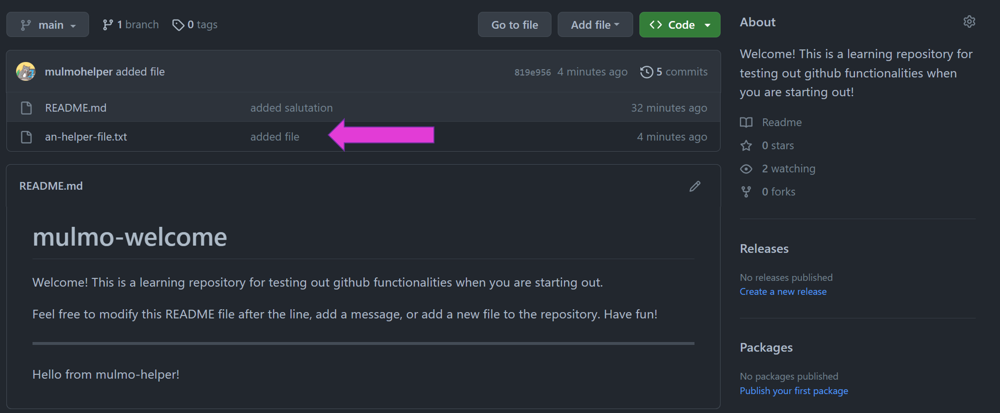

And that's it - congratulations! You have *cloned* your first repo, made local changes to the files and *committed* and *pushed* them to the *origin* remote repository, in the *main* branch. You have also learned how to add your own files to the repository to contribute your work for review or to improve on the production code we use.

This makes you able to manage almost everything you need to do to to work together with the rest of the team, for any other doubts refer to the other more detailed guides or better yet, ask your team mates for help!
Welcome to Mulmopro 😊!


# Sources and more info:
- Video how to start using GIT and VSCode (7 minutes)
>https://www.youtube.com/watch?v=i_23KUAEtUM

 - Video showing a live demo of working on the WSL (30 minutes)
>https://www.youtube.com/watch?v=t4eFjyJWmqQ

- WSL on Windows 10: use the store version
>https://arstechnica.com/gadgets/2022/11/windows-subsystem-for-linux-with-gui-apps-launches-for-windows-10/


# Troubleshooting

### Installing WSL
Should be ok with windows11 on most versions, threre could be an error on opening it up on some versions, it tells you to update the wsl kernel, like here:
https://docs.microsoft.com/en-us/windows/wsl/install-manual#step-4---download-the-linux-kernel-update-package

Then, enable Virtual Machine Platform
Win+R optionalfeatures.exe

Some answers and explanations also found in this [StackOverflow thread](https://askubuntu.com/questions/1447753/error-when-installing-wsl-and-ubuntu-on-windows-11).

### Explorer doesn't explore wsl folders
**Don't** quick pin it! Manualy (ctrl+L) navigate to:
\\wsl$\Ubuntu-20.04
https://superuser.com/questions/1671618/wsl2-not-accessible-through-windows-but-works-fine-through-terminal

### Note: WSL and Virtualbox issues
having WSL enabled or any other sort of windows virualization does not play well with virtualbox, so look here under "WSL might be the culrpit"
https://askubuntu.com/questions/927755/ubuntu-16-04-2-in-virtual-box-does-not-start

basically win+r optionalfeatures.exe disable Virtual Machine Platform, reboot, do your stuff in virtuabox, re-enable it, reboot again, and use wsl again. 
